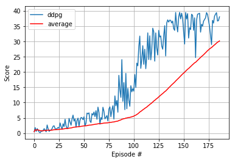

# Deep Reinforcement Learning Agent for Reacher App 

## Trained Agent 

Here's the gif showing the trained agent based on [DDPG Algorithm](https://github.com/monusurana/reinforcement-learning-navigation/blob/master/agents/ddpg_agent.py) trained on [Unity's](https://github.com/Unity-Technologies/ml-agents) Reacher environment. 


## Implementation Details 

Implemented and trained DDPG algorithm for solving Reacher environment. 

### DDPG 

The implementation of dqn is in ```agents/ddpg_agent.py``` and the trained model can be found at ```models/checkpoint_actor_ddpg.pth``` and ```models/checkpoint_critic_ddpg.pth```

#### Actor Architecture
```
```

#### Critic Architecture

These are the key pieces of the algorithm

### Experience Replay 

Experience replay allows the RL agent to learn from past experiences. Each experience is stored in a replay buffer as the agent interacts with the environment. The replay buffer contains experience tuples with the state, action, reward, and next state ```(s, a, r, s')```. The agent randomly samples from this buffer as part of the training. Random samplaing helps with the problem of correlated data. This prevents action values from oscillating, since a naive Q-learning algorithm could otherwise become biased by correlations between sequential experience tuples.

Also, experience replay improves learning through repetition. By doing multiple passes over the data, our agent has multiple opportunities to learn from a single experience tuple. This is particularly useful for state-action pairs that occur infrequently within the environment.

The implementation of the replay buffer can be found here in the ```buffers/ReplayBuffer.py``` file of the source code.

### Target Network 

Iterative update that adjusts the action-values towards target values that are only periodically updated, thereby reducing correlations with the target.

The target values are updated based on this equation. 
```
 θ_target = τ*θ_local + (1 - τ)*θ_target
```

You can find logic implemented in ```soft_update()``` method in ```dqn_agent.py``` of the source code. 

## Hyperparameters 

The agent uses these parameters
```
BUFFER_SIZE = int(1e5)  # replay buffer size
BATCH_SIZE = 128        # minibatch size
GAMMA = 0.99            # discount factor
TAU = 1e-3              # for soft update of target parameters
LR_ACTOR = 2e-4         # learning rate of the actor 
LR_CRITIC = 2e-4        # learning rate of the critic
WEIGHT_DECAY = 0        # L2 weight decay
```

The training part uses these paramters
```
Number of training episodes = 500
Max number of steps in an episode = 10000
```

## Results



## Ideas for future work 
- Tuning of hyperparameters for the network 
- Use Prioritized Experience Replay ([Link](https://arxiv.org/pdf/1511.05952.pdf))
- Implement PPO and A3C and evaluate performance compared to DDPG
